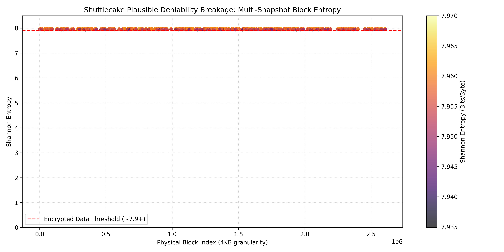
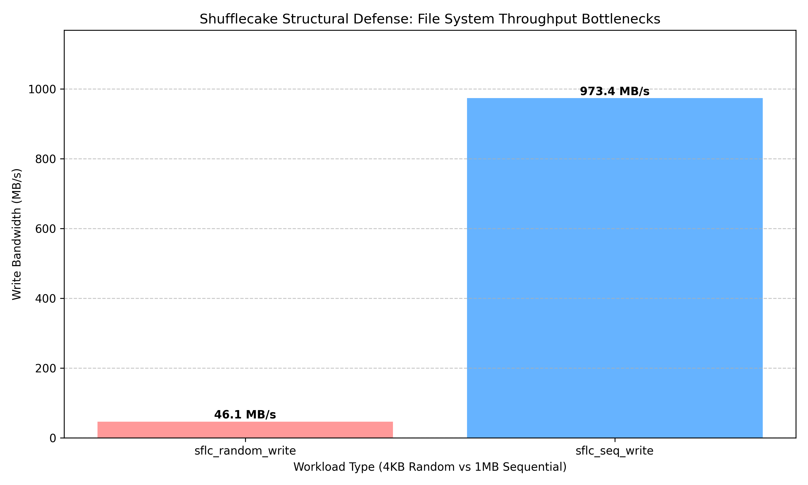

# 🍰 Shufflecake Forensic Audit Suite


An automated forensic testbench designed to evaluate the operational security (OpSec) and structural footprint of block-layer Plausible Deniability (PD) filesystems. 

Specifically engineered to audit [Shufflecake](https://codeberg.org/shufflecake/shufflecake-c), this suite provides quantitative tooling to measure multi-snapshot entropy leakage, I/O timing side-channels, and host-level OS telemetry footprints.

## 🎯 Overview
Plausible Deniability architectures (like Shufflecake) hide encrypted data by distributing it in random, non-contiguous slices across a storage medium, effectively masking it as free space. While cryptographically sound, deploying these architectures on standard operating systems introduces complex metadata and hardware interaction footprints. 

This auditing suite provides security researchers and systems engineers with a standardized, automated methodology to measure those footprints without manually parsing raw block devices.

## 🧰 Testbench Architecture

The suite is divided into three standalone forensic modules:

### 1. Multi-Snapshot Entropy Analysis (`mod1_entropy_defense`)
Evaluates the leakage of hidden volumes by diffing raw disk images (`.img`) across temporal snapshots.
* **Mechanism:** Scans physical 4KB blocks, calculates Shannon entropy variations, and identifies clustering of high-entropy data indicative of hidden block allocations.
* **Tooling:** Python, NumPy, Matplotlib.

### 2. Structural I/O Profiling (`mod2_fs_stress`)
Measures timing side-channels introduced by randomized slice-allocation translation layers.
* **Mechanism:** Utilizes the POSIX Asynchronous I/O engine to stress-test the virtual block device with multi-threaded random and sequential write workloads, isolating the allocation latency penalty.
* **Tooling:** Bash, `fio` (Flexible I/O Tester), Python JSON Parsing.

### 3. OS Telemetry Hardening (`mod3_os_hardening`)
Scrapes and mitigates metadata footprints left on the host operating system.
* **Mechanism:** Harvests the Linux kernel ring buffer (`dmesg`), system log (`syslog`), and authentication daemons (`auth.log`) for module initialization, bio allocation errors, and mount commands. Includes a teardown script to safely dismount and flush RAM pagecaches.
* **Tooling:** Bash, Linux Core Utilities, `sed`, `awk`.

---

## 📊 Sample Visualizations & Output

*(Note: The following visualizations were generated on a dual-drive Ubuntu 22.04 VM running Kernel 6.8).*

### Block-Level Entropy Leakage
When a standard filesystem writes to a hidden volume, scattered metadata creates an observable high-entropy footprint against the OS's natural noise.


### Timing Side-Channel Exposure
Standard sequential writes operate near hardware limits, but forcing the translation layer to handle highly fragmented 4KB random writes reveals a severe, observable latency penalty.


---

## ⚙️ Installation & Usage

### Prerequisites
* Linux Environment (Ubuntu 22.04 / Kernel 6.8 recommended)
* Root/Sudo privileges (for device mapping and block-level access)
* Python 3.12+ (with `numpy` and `matplotlib`)
* `fio` (Flexible I/O Tester)

### Execution

**1. Clone the suite:**
```bash
git clone https://github.com/yourusername/shufflecake-audit-suite.git
cd shufflecake-audit-suite
pip install -r mod1_entropy_defense/requirements.txt
```

**2. Run Module 1 (Entropy Diffing):**
*(Requires two pre-captured `.img` snapshots of the target block device)*
```bash
python3 mod1_entropy_defense/snapshot_diff.py baseline.img post_write.img
python3 mod1_entropy_defense/visualize_blocks.py entropy_report.json -o docs/entropy_heatmap.png
```

**3. Run Module 2 (FS Stress):**
*(Requires an actively mounted Shufflecake volume)*
```bash
sudo ./mod2_fs_stress/benchmark_matrix.sh /mnt/sflc_hidden ext4_results.json
python3 mod2_fs_stress/parse_fio.py ext4_results.json -o docs/fs_benchmark.png
```

**4. Run Module 3 (Telemetry Audit & Secure Close):**
```bash
sudo ./mod3_os_hardening/harvest_telemetry.sh
sudo ./mod3_os_hardening/sflc_secure_close.sh /dev/sdb
```

## 📝 Disclaimer
This tool was developed for academic and security research purposes (McGill University). It is designed to evaluate the operational security of local storage systems. Do not use this tool on production drives containing critical data, as the stress-testing components involve aggressive block-level operations.